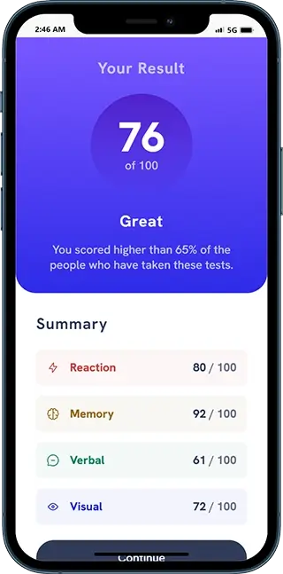
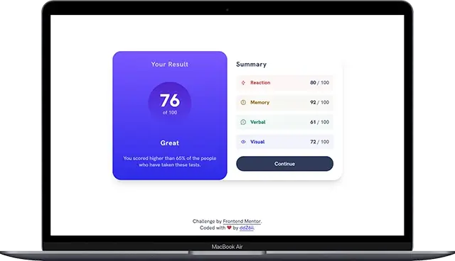

# Frontend Mentor - Results summary component solution

This is a solution to the [Results summary component challenge on Frontend Mentor](https://www.frontendmentor.io/challenges/results-summary-component-CE_K6s0maV). Frontend Mentor challenges help you improve your coding skills by building realistic projects.

## Table of contents

- [Overview](#overview)
  - [The challenge](#the-challenge)
  - [Screenshots](#screenshots)
  - [Links](#links)
- [Getting started](#getting-started)
- [My process](#my-process)
  - [Built with](#built-with)
  - [Deployed with](#deployed-with)
- [Author](#author)

## Overview

### The challenge

Users should be able to:

- View the optimal layout for the interface depending on their device's screen size
- See hover and focus states for all interactive elements on the page
- **Bonus**: Use the local JSON data to dynamically populate the content

### Screenshots

- Mobile:

  

- Laptop/Desktop:

  

### Links

- Solution URL: [frontend-mentor-solution](https://www.frontendmentor.io/solutions/responsive-component-with-dynamically-populated-content-41iqefxnMR)
- Live Site URL: [results-summary-component](https://results-summary-component-eight-eta.vercel.app/)

## Getting started

1. Clone the project and run the following command:

```console
yarn install
```

This will initialize the project by installing all the required dependencies.

2. Start the development server:

```console
yarn run dev
```

3. Build for production (output to the `/dist` folder):

```console
yarn run build
```

## My process

### Built with


- Semantic HTML5 markup
- CSS Grid
- CSS Flexbox
- JavaScript for loading dynamic content
- Vite bundler
- Mobile-first workflow

### Deployed with


## Author

- Github - [ddZ6ii](https://github.com/ddZ6ii)
- Frontend Mentor - [ddZ6ii](https://www.frontendmentor.io/profile/ddZ6ii)
- Linkedin - [denis-dezest](https://www.linkedin.com/in/denis-dezest/)
